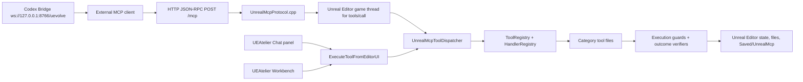

# MCP Structure

## Versioned MCP Structures

This page primarily describes the supported public `main`/`v0.34.0` structure. `v0.33.0-preview` is intentionally different: it is a UE 5.8 official-MCP validation branch and should be read through [[v0.33 Official MCP Preview]].

| Version line | Endpoint(s) | Meaning |
| --- | --- | --- |
| `v0.34.0` supported public line | `http://127.0.0.1:8765/mcp` | UEAtelier-owned JSON-RPC MCP endpoint serving the `unreal.*` tool inventory. |
| `v0.33.0-preview` UE 5.8 experiment | `:8765/mcp` plus opt-in official `:8000/mcp` | Dual-track validation with UE 5.8 `ToolsetRegistry + ModelContextProtocol`; official server is stateful streamable HTTP and exposes `list_toolsets`, `describe_toolset`, and `call_tool` meta-tools. |

The `v0.33.0-preview` official track is behind `UNREALMCP_HAS_OFFICIAL_TOOLSETS`; UE 5.6/5.7 builds are intended to be byte-unaffected. Generated official toolsets must delegate into UEAtelier's audited `call_tool` policy executor.

## Runtime Shape

UEAtelier runs a local HTTP JSON-RPC MCP endpoint inside Unreal Editor. The in-editor Chat panel, Workbench panel, external MCP clients, and Codex bridge all converge on the same tool handlers and registry policy metadata.

## Endpoint and Transport

| Item | Value |
| --- | --- |
| Default endpoint | `http://127.0.0.1:8765/mcp` |
| Default path | `/mcp` |
| Default host | localhost only |
| Supported HTTP verb for JSON-RPC | `POST` |
| `GET` behavior | 405, no SSE stream |
| `DELETE` behavior | 405, stateless requests, no MCP sessions |
| Protocol version | `2025-06-18` |
| Game-thread timeout for `tools/call` | 30 seconds |
| Optional controls | allowed origins and bearer token in Unreal MCP settings |

## JSON-RPC Methods

| Method | Behavior |
| --- | --- |
| `initialize` | Negotiates protocol version (latest `2025-06-18`), returns `serverInfo` = `{name: "unreal-editor-mcp", version: "0.10.4"}` (hardcoded; does not track the plugin VersionName), `capabilities.tools.listChanged: false`, and an instructions string ending with the endpoint URL. |
| `notifications/initialized` | Accepted as a notification. |
| `notifications/cancelled` | Accepted as a notification. |
| `ping` | Returns an empty result object. |
| `tools/list` | Returns `{tools:[...]}` only. The non-spec top-level `structuredContent` field was removed in v0.32.2. |
| `tools/call` | Requires `params.name`; optional `params.arguments` must be an object. Dispatches on the Unreal game thread and returns MCP content, `isError`, and optional `structuredContent`. |

## Response Builders

Protocol response construction is centralized in `UnrealMcp::Protocol` pure helpers:

- `BuildInitializeResult`
- `BuildPingResult`
- `BuildToolsListResult`
- `BuildToolCallResult`
- `BuildJsonRpcResultEnvelope`
- `BuildJsonRpcErrorEnvelope`

These are pinned by automation tests after the v0.32.2 strict-client incident where a non-spec top-level `structuredContent` on `tools/list` was parsed incorrectly by rmcp 0.15.

## Tool Dispatch Stack

1. `FUnrealMcpModule::HandleMcpHttpRequest` parses method and routes `tools/call` to the game thread.
2. `HandleMcpHttpRequestInternal` validates origin, authorization, protocol header, JSON-RPC version, params, and method.
3. `HandleToolsCall` normalizes arguments, calls `ExecuteTool`, and writes a `tool_call` ActivityLog event for known tools.
4. `UnrealMcpToolDispatcher` routes to the relevant category handler.
5. Tool metadata comes from code descriptors plus JSON registry override.
6. Execution guard and category-specific verifiers attach preflight/postcheck evidence for write-capable tools.

## Registry and Metadata

The ToolRegistry is central and explicit:

- `Tools/UnrealMcpToolRegistry/tools.json` is the canonical project-root registry.
- The registry currently holds **190 entries**: **178** with `exposure: visible` (served over `tools/list`) and **12** with `exposure: legacy_hidden` (legacy flexible-schema tools such as `unreal.spawn_actor` and `unreal.mcp_extension_pipeline`, still callable for compat but never serialized to the wire). Count is enforced by `python3 Tools/validate_tool_registry.py` and must stay synced with the plugin mirror `Plugins/UnrealMcp/Resources/ToolRegistry/tools.json`.
- `Plugins/UnrealMcp/Resources/ToolRegistry/tools.json` is the plugin mirror.
- `Tools/UnrealMcpToolRegistry/schema.json` and `Schemas/UnrealMcpToolRegistry.schema.json` define the schema.
- `UnrealMcpToolRegistrar.cpp` carries code-owned descriptors and fixed schemas.
- `UnrealMcpToolHandlerRegistry` derives handler/category/policy view from the combined descriptor-plus-JSON registry.

## UI Surfaces

- `SUnrealMcpChatPanel`: conversational command and AI surface.
- `SUnrealMcpWorkbenchPanel`: dashboard over existing MCP tools.
- `STaskAtlasWindow`: task/workflow view backed by Task Atlas tools and registry metadata.

The Chat panel opens via **Window > UEAtelier Chat** and the Workbench via **Window > UEAtelier Workbench** (tab display names and menu entries registered in `UnrealMcpEditorTabs.cpp`); the Task Atlas window is opened from the Chat panel.

## Codex Bridge

The bridge under `Tools/UnrealMcpCodexBridge` starts `codex app-server`, connects through Codex App Server transport, creates one thread, and exposes a UE-facing WebSocket at `ws://127.0.0.1:8766/uevolve`. It registers the Unreal MCP endpoint as a streamable HTTP MCP server so Codex uses native `mcpServer/tool/call` routing instead of shelling out or using direct HTTP.

Bridge defaults:

| Setting | Default |
| --- | --- |
| Model | `gpt-5.5` |
| Effort | `xhigh` |
| Sandbox | `workspace-write` |
| Network access | enabled for workspace-write in v0.34.0 |
| Approval policy | rejects built-in file/command/permission/user-input/elicitation requests (`applyPatchApproval`, `execCommandApproval`, `item/commandExecution/requestApproval`, `item/fileChange/requestApproval`, `item/permissions/requestApproval`, `item/tool/requestUserInput`, `item/tool/call`); sole exception: form-mode MCP elicitations carrying `codex_approval_kind: mcp_tool_call` from the registered `unrealmcp` server are auto-accepted so Unreal MCP tool calls proceed |
| UE-facing endpoint | `ws://127.0.0.1:8766/uevolve` |
| MCP endpoint registered for Codex | `http://127.0.0.1:8765/mcp` |

## Runtime State

Local runtime state is under `Saved/UnrealMcp/` and is not committed. Important subareas include `ActivityLog/`, `Tasks/`, `TaskAtlasDrafts/`, `CapturedToolArgs/`, `KnowledgeSources/` (incl. `KnowledgeSources/TaskAtlas/` for To-RAG promotions), `KnowledgeIndex/`, `CodeChanges/` (incl. `CodeChanges/Previews/`), `ProjectMemory.json`, `ChatHistory.json`, `SkillDrafts/`, `SupervisorLogs/`, `Packages/`, `ExtensionBackups/` plus `LastExtensionApply.json`, `AutomationRuns/`, `BuildLogs/`, `MakeToolSetFailures/`, and `TestScaffolds/`.
