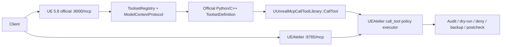

# v0.33 Official MCP Preview

This note corrects an important version split: `v0.33.0-preview` is not the normal UEAtelier MCP structure on `main`. It is an experimental UE 5.8 official-MCP validation branch.

## Identity

| Field | Value |
| --- | --- |
| Tag | `v0.33.0-preview` |
| GitHub release | https://github.com/edwinmeng163-oss/UEAtelier/releases/tag/v0.33.0-preview |
| Release type | GitHub pre-release / experimental preview |
| Branch | `experiment/v0.33-ue58-validation` |
| Purpose | Validate UE 5.8 first-party MCP integration |
| Supported public line after v0.32.2 | `v0.34.0` for UE 5.6 / UE 5.7 |
| Mainline status | Does not merge to `main` as-is |

## Architecture Difference

`v0.33.0-preview` uses a dual-track structure:

| Track | Endpoint | Role | Status |
| --- | --- | --- | --- |
| UEAtelier track | `127.0.0.1:8765/mcp` | Existing `unreal.*` tool surface, policy, audit, Task Atlas, code tools, rollback, RAG, self-extension behavior | Still the supported surface |
| UE 5.8 official track | `127.0.0.1:8000/mcp` when enabled | Unreal Engine 5.8 first-party `ToolsetRegistry + ModelContextProtocol` server | Experimental, opt-in, default OFF |

The official track is stateful streamable HTTP. After `initialize`, clients must carry the `Mcp-Session-Id` header/session id on later requests. The official surface exposes meta-tools such as `list_toolsets`, `describe_toolset`, and `call_tool`, rather than directly mirroring every `unreal.*` tool at top level.



## Compile Gate

All official-toolset integration is behind `UNREALMCP_HAS_OFFICIAL_TOOLSETS`. UE 5.6/5.7 builds are intended to be byte-unaffected, with gate-exclusion builds proving zero official-API references.

## Included Preview Capabilities

- Opt-in official `:8000` server controlled from the Workbench card or `ModelContextProtocol.StartServer <port>` / `ModelContextProtocol.StopServer`.
- Task Atlas `emitOfficial` generation for official Python `ToolsetDefinition` wrappers.
- Official C++ `UToolsetDefinition` draft generation with descriptor, Build.cs, module, AICallable methods, hash-bound manifest, validator, drift detector, and explicit project-mounted UBT build probe.
- AgentSkill promotion as instruction-only documentation of generated tool usage.
- Delegation rule: generated official toolsets must route side effects through UEAtelier's audited `call_tool` policy executor.

## Safety Boundary

Official ToolsetRegistry is used for discovery and invocation, not as an ungoverned execution bypass. Every generated official path must delegate into UEAtelier for approval checks, dry-run forcing, deny policy, path safety, ActivityLog/audit, captured-argument redaction, backups/manifests/rollback, and postcheck verification.

## Verified In Preview

- Official-area automation suites 13/13 green.
- UE 5.6 + UE 5.7 + UE 5.8 builds green.
- 5.7 gate-exclusion build has zero official-API references.
- Registry validator 190/190.
- Live post-restart proof: a built native toolset registered with engine ToolsetRegistry, was discovered/described/called over official `:8000`, delegated into UEAtelier policy executor with an audit row, while `:8765` served in the same session.

## Known Caveats

- Interactive-editor `automation_list/run` sees zero tests; commandlets are authoritative.
- Stopping the official server removes the MCP route, but the TCP port remains bound by the engine shared HTTP listener.
- Spike 3, `MCPClientToolset -> :8765`, was not exercised.
- `:8765` still accepted protocol `2025-06-18`; a future protocol bump to `2025-11-25` was deferred/tracked.

## Assets From GitHub

| Asset | Size | Digest | URL |
| --- | ---: | --- | --- |
| `UnrealMcp-v0.33.0-preview-mac-ue56-ue57-ue58-projectroot.zip` | 968.6 KiB | `sha256:47734b988e4cd0c4b02769e0b7345a16d0e80c3a90af27fec1c0b2ed526f2858` | https://github.com/edwinmeng163-oss/UEAtelier/releases/download/v0.33.0-preview/UnrealMcp-v0.33.0-preview-mac-ue56-ue57-ue58-projectroot.zip |
| `UnrealMcp-v0.33.0-preview-mac-ue56-ue57-ue58-projectroot.zip.sha256` | 127 B | `sha256:cb234ce2a2d411e3ef4835e1f2398c452a9accfb10d1a45d3998518dce8edecc` | https://github.com/edwinmeng163-oss/UEAtelier/releases/download/v0.33.0-preview/UnrealMcp-v0.33.0-preview-mac-ue56-ue57-ue58-projectroot.zip.sha256 |
| `UnrealMcp-v0.33.0-preview-win-ue56-ue57-ue58-projectroot.zip` | 965.2 KiB | `sha256:6c2c595fa90be67030fe1644372a70229694a0991b71a544eb07aba8cb466581` | https://github.com/edwinmeng163-oss/UEAtelier/releases/download/v0.33.0-preview/UnrealMcp-v0.33.0-preview-win-ue56-ue57-ue58-projectroot.zip |
| `UnrealMcp-v0.33.0-preview-win-ue56-ue57-ue58-projectroot.zip.sha256` | 127 B | `sha256:f4a0208c8cce99890503aaa57ec6510b0682e0d9ac4994e0e55f19280469ff7e` | https://github.com/edwinmeng163-oss/UEAtelier/releases/download/v0.33.0-preview/UnrealMcp-v0.33.0-preview-win-ue56-ue57-ue58-projectroot.zip.sha256 |

## Tagged Files Of Interest

- `Docs/Release-2026-07b.md`
- `Docs/planning/UEAtelier-v0.33-ue58-validation-R0.md`
- `Tools/UnrealMcpOfficialToolsets/README.md`
- `Tools/UnrealMcpOfficialToolsets/ueatelier_official_toolset.py`
- `Tools/UnrealMcpOfficialToolsets/validate_official_toolset.py`
- `Plugins/UnrealMcp/Source/UnrealMcp/Private/UnrealMcpOfficialCppToolsetEmitter.cpp/.h`
- `Plugins/UnrealMcp/Source/UnrealMcp/Private/Tests/UnrealMcpOfficial*Tests.cpp`

## GitHub Release Body

# UEAtelier Release Notes - v0.33.0-preview (2026-07)

> **EXPERIMENTAL PREVIEW.** UE 5.8 official-MCP validation build from
> `experiment/v0.33-ue58-validation`. This branch never merges to main as-is;
> the supported public line is **v0.34.0** (UE 5.6/5.7). Use this preview only
> to evaluate UE 5.8 first-party MCP integration.

## English

### What this preview is

UEAtelier layered additively on top of Unreal Engine 5.8's first-party MCP
stack (ToolsetRegistry + ModelContextProtocol). Everything is compiled behind
a single gate (`UNREALMCP_HAS_OFFICIAL_TOOLSETS`): UE 5.6/5.7 builds are
byte-unaffected, verified by gate-exclusion builds with zero official-API
references. UEAtelier's own `:8765` server remains the supported surface.

### What's included

- **Opt-in official `:8000` server**: default OFF; start/stop from the
  UEAtelier Workbench card or the engine console commands
  `ModelContextProtocol.StartServer <port>` / `ModelContextProtocol.StopServer`.
  The official server is stateful streamable-HTTP (carry the `Mcp-Session-Id`
  from initialize) and exposes `list_toolsets` / `describe_toolset` /
  `call_tool` meta-tools.
- **Official Python toolset generation** from Task Atlas: `emitOfficial` on
  `task_atlas_make_composite` generates a delegating official Python
  `ToolsetDefinition` (hot-registered, no restart).
- **Official C++ toolset draft path**: `officialVariant:"cpp"` emits a
  complete native `UToolsetDefinition` plugin draft (descriptor, Build.cs,
  module, class with AICallable methods delegating through
  `UUnrealMcpCallToolLibrary::CallTool`), validated by an allowlist source
  validator, hash-bound manifest, post-publish drift detector, and an explicit
  project-mounted UBT build probe. Build + editor restart are required and
  honestly reported; nothing is auto-installed or auto-registered.
- **AgentSkill promotion (instruction-only)**: a made tool can be promoted to
  an engine AgentSkill asset documenting when/how to use it (and removed
  again); execution always stays with the callable tool under policy.
- Every generated path delegates side effects through UEAtelier's audited
  `call_tool` policy executor.

### Verified

- Official-area automation suites 13/13 green (generation, wiring, C++
  emitter/validator/drift, AgentSkill promotion, server toggle lifecycle).
- UE 5.6 + 5.7 + 5.8 builds green; 5.7 gate-exclusion build has zero
  official-API references. Registry validator 190/190.
- Live post-restart proof: a built native toolset registered with the engine
  ToolsetRegistry, was discovered/described/called over official `:8000`, and
  its execution delegated into the UEAtelier policy executor with an audit
  row, while `:8765` served in the same session.

### Known caveats

- Interactive-editor `automation_list/run` see zero tests (commandlets are
  authoritative).
- Stopping the official server removes the MCP route; the TCP port stays
  bound by the engine's shared HTTP listener.
- MCPClientToolset -> `:8765` (Spike 3) has not been exercised.

### Assets

```text
UnrealMcp-v0.33.0-preview-mac-ue56-ue57-ue58-projectroot.zip
SHA-256: 47734b988e4cd0c4b02769e0b7345a16d0e80c3a90af27fec1c0b2ed526f2858
UnrealMcp-v0.33.0-preview-win-ue56-ue57-ue58-projectroot.zip
SHA-256: 6c2c595fa90be67030fe1644372a70229694a0991b71a544eb07aba8cb466581
```

Naming note: the package is a single source tree that builds on UE 5.6, 5.7,
and 5.8. Official-MCP features compile and activate on UE 5.8 only; on
5.6/5.7 the plugin behaves exactly like the baseline release.


## 中文

### 本预览版是什么

UEAtelier 以增量方式叠加在 Unreal Engine 5.8 官方 MCP 栈（ToolsetRegistry +
ModelContextProtocol）之上。所有代码都在单一编译门
`UNREALMCP_HAS_OFFICIAL_TOOLSETS` 之后：UE 5.6/5.7 构建字节级不受影响（由
gate-exclusion 构建验证，日志中官方 API 引用为零）。UEAtelier 自有的 `:8765`
服务器仍是受支持的接入面。**实验性预览：本分支不会按原样合入 main；受支持的
公开版本是 v0.34.0（UE 5.6/5.7）。**

### 包含内容

- **可选启用的官方 `:8000` 服务器**：默认关闭；通过 Workbench 卡片或引擎控制台
  命令 `ModelContextProtocol.StartServer <port>` / `.StopServer` 启停。官方服务器
  为有状态 streamable-HTTP（initialize 后续请求需携带 `Mcp-Session-Id`），暴露
  `list_toolsets` / `describe_toolset` / `call_tool` 元工具。
- **Task Atlas 生成官方 Python toolset**：`task_atlas_make_composite` 的
  `emitOfficial` 生成委托执行的官方 Python `ToolsetDefinition`（热注册，无需重启）。
- **官方 C++ toolset 草稿路径**：`officialVariant:"cpp"` 生成完整的原生
  `UToolsetDefinition` 插件草稿（descriptor、Build.cs、模块、带 AICallable 方法的
  类，全部通过 `UUnrealMcpCallToolLibrary::CallTool` 委托执行），配套 allowlist
  源码校验器、哈希绑定 manifest、发布后漂移检测器，以及显式的项目挂载 UBT 构建
  探针。需要构建 + 编辑器重启，并如实上报状态；不会自动安装或自动注册。
- **AgentSkill 提升（仅说明性）**：可将生成工具提升为引擎 AgentSkill 资产
  （记录何时/如何使用，可撤销）；执行始终归属受策略管控的可调用工具。
- 所有生成路径的副作用都通过 UEAtelier 审计的 `call_tool` 策略执行器。

### 已验证

官方区自动化 13/13 全绿；UE 5.6+5.7+5.8 构建通过；5.7 gate-exclusion 构建官方
API 引用为零；registry 校验 190/190；重启后实机验证：原生 toolset 注册、经官方
`:8000` 发现/描述/调用、执行委托进入 UEAtelier 策略执行器并产生审计记录，
`:8765` 同会话共存。

### 已知注意事项

交互式编辑器内 `automation_list/run` 看不到测试（以 commandlet 为准）；停止官方
服务器会移除 MCP 路由，但 TCP 端口仍被引擎共享 HTTP 监听器占用；Spike 3
（MCPClientToolset -> `:8765`）未执行。

## 日本語

### このプレビューについて

UEAtelier を Unreal Engine 5.8 のファーストパーティ MCP スタック
（ToolsetRegistry + ModelContextProtocol）の上に追加レイヤーとして統合した
検証ビルドです。すべて単一のコンパイルゲート
`UNREALMCP_HAS_OFFICIAL_TOOLSETS` の背後にあり、UE 5.6/5.7 ビルドはバイト単位で
不変（gate-exclusion ビルドで公式 API 参照ゼロを確認済み）。UEAtelier 自身の
`:8765` サーバーが引き続きサポート対象の窓口です。**実験的プレビュー：この
ブランチはそのまま main にマージされません。サポート対象の公開版は v0.34.0
（UE 5.6/5.7）です。**

### 含まれる内容

- **オプトインの公式 `:8000` サーバー**：デフォルト OFF。Workbench カードまたは
  コンソールコマンド `ModelContextProtocol.StartServer <port>` / `.StopServer`
  で起動/停止。公式サーバーはステートフルな streamable-HTTP（initialize 後は
  `Mcp-Session-Id` を必ず付与）で、`list_toolsets` / `describe_toolset` /
  `call_tool` のメタツールを公開します。
- **Task Atlas からの公式 Python toolset 生成**：`task_atlas_make_composite` の
  `emitOfficial` が委譲実行型の公式 Python `ToolsetDefinition` を生成
  （ホット登録、再起動不要）。
- **公式 C++ toolset ドラフトパス**：`officialVariant:"cpp"` がネイティブ
  `UToolsetDefinition` プラグインドラフト一式を生成（descriptor、Build.cs、
  モジュール、`UUnrealMcpCallToolLibrary::CallTool` へ委譲する AICallable
  メソッド群）。allowlist ソースバリデーター、ハッシュ結合 manifest、公開後の
  ドリフト検出器、明示的なプロジェクトマウント UBT ビルドプローブ付き。
  ビルド + エディタ再起動が必要で、状態は正直に報告されます。自動インストール
  や自動登録は行いません。
- **AgentSkill 昇格（説明のみ）**：生成ツールをエンジンの AgentSkill アセットに
  昇格（使いどころを文書化、取り消し可能）。実行は常にポリシー管理下の
  呼び出し可能ツール側にあります。
- 生成されたすべての経路の副作用は、監査付き `call_tool` ポリシー実行器を
  経由します。

### 検証済み

公式領域の自動化スイート 13/13 グリーン。UE 5.6+5.7+5.8 ビルド成功。5.7
gate-exclusion ビルドで公式 API 参照ゼロ。registry 検証 190/190。再起動後の
実機証明：ネイティブ toolset が ToolsetRegistry に登録され、公式 `:8000` 経由で
発見/記述/呼び出しされ、実行が UEAtelier ポリシー実行器へ委譲され監査行を
生成、同一セッションで `:8765` と共存。

### 既知の注意点

対話型エディタ内の `automation_list/run` はテストを検出しません（commandlet が
正）。公式サーバー停止で MCP ルートは除去されますが、TCP ポートはエンジン共有
HTTP リスナーが保持します。Spike 3（MCPClientToolset -> `:8765`）は未実施。

## Official Toolsets README At Tag

# UEAtelier Official Toolsets

This directory contains the UE 5.8+ official ToolsetRegistry adapter proof.
Official toolsets are discovery and invocation wrappers only. Every exposed
capability must delegate to `unreal.UnrealMcpCallTool.call_tool` so UEAtelier
policy, dry-run forcing, denial, ActivityLog audit, redaction, backup/rollback,
and postcheck behavior remain authoritative.

Run the local structural tests with:

```bash
python3 -m unittest discover Tools/UnrealMcpOfficialToolsets/tests
```

## Planning / Validation Notes At Tag

# UEAtelier v0.33 UE5.8 Validation — R0 Plan

**Status**: R0 draft for `experiment/v0.33-ue58-validation`.

**Baseline**: branch is isolated from main `7e796ca` (`v0.32.2`) plus the
minimum cherry-picked UE5.8 compatibility commits. This branch is a validation
worktree and **never merges to main** as-is.

**Goal**: Validate a UE5.8-only official-MCP integration direction without
weakening the shipped v0.32.x UE5.6/UE5.7 line.

**Decision locked**: v0.33 is a UE5.8-only validation build. UE5.6/UE5.7 keep
building from the v0.32.x line; they are not part of this validation release
surface.

---

## 1. Scope and explicit non-goals

### Scope

v0.33 validates whether UEAtelier can safely layer UE5.8's official MCP stack
into the product model:

1. Build the existing UEAtelier plugin and UE5.8 example host against promoted
   UE 5.8.
2. Keep UEAtelier's current Streamable HTTP MCP server on `127.0.0.1:8765/mcp`
   for the existing `unreal.*` tool surface.
3. Add an optional UE5.8 official ToolsetRegistry / ModelContextProtocol usage
   track on the official side, expected at `127.0.0.1:8000/mcp` when enabled.
4. Validate official Python `ToolsetDefinition` as the runtime-hot substrate for
   Task Atlas Make Tools.
5. Restore the Task Atlas Make Tool Set product path only through a guarded,
   policy-preserving official-Python adapter.
6. Produce enough evidence to choose the next milestone: validation-only,
   delegating adapter subset, or full official-path Make Tools surface.

### Explicit non-goals

- No tri-engine v0.33 public release.
- No UE5.6/UE5.7 official-MCP backport.
- No removal of UE5.6/UE5.7 support from the main product line.
- No merge of this validation branch to main as-is.
- No replacement of UEAtelier's `:8765` server.
- No dependency on Epic AIAssistant or Epic cloud services.
- No redistribution of Epic NoRedist / Experimental modules.
- No direct AI-authored core C++ handler generation.
- No runtime C++ Make Tools path.
- No weakening of UEAtelier approval, dry-run, audit, path policy, backup,
  manifest, rollback, or captured-argument redaction guarantees.

---

## 2. Architecture direction

### Dual-track tool usage

v0.33 validation keeps two tool-usage tracks:

- **UEAtelier track**: the existing `unreal.*` server at `127.0.0.1:8765/mcp`,
  preserving the shipped policy, audit, Task Atlas, code-tools, rollback, RAG,
  and self-extension behavior.
- **Official UE5.8 track**: optional official ToolsetRegistry +
  ModelContextProtocol, exposed through the official server when enabled
  (`127.0.0.1:8000/mcp` by default).

The two tracks are additive during validation. Official ToolsetRegistry does not
become the cross-version foundation for UE5.6/UE5.7.

### Official-first tool creation

Tool creation is official-first on UE5.8, with a strict split by runtime model:

- **Python-first runtime creation**: official Python `ToolsetDefinition` is the
  default candidate for runtime Make Tools. Spike 1 proved the load-bearing
  assumption: Python toolsets can register, list, call, and reload without an
  editor restart through official MCP.
- **C++ restart-required promotion**: official C++ `UToolsetDefinition` remains
  a developer-promotion path only. It is useful for deliberate native toolsets,
  but it is not a runtime Make Tools substrate because reflected C++ still needs
  compile + editor restart.

---

## 3. Restoring Task Atlas Make Tools safely

Task Atlas **Make Tool Set** should be restored, but the backend changes:

1. Task Atlas classifies a task or cluster.
2. RAG/tool recommendation runs first to avoid duplicate tool creation.
3. If the task is `official_python_ready`, UEAtelier generates an official
   Python `ToolsetDefinition` wrapper.
4. The wrapper registers into official ToolsetRegistry and becomes reachable via
   official MCP.
5. The generated wrapper **does not directly mutate editor or project state**.
   It delegates execution back into a UEAtelier policy executor.

This is the key safety boundary. The button was walled off after the v0.26 risk
class because AI-generated handlers could bypass product guardrails. Restoring
Make Tools through official Python is acceptable only if generated official
wrappers delegate back into UEAtelier for:

- approval checks,
- dry-run and force-dry-run policy,
- deny policy,
- path safety,
- ActivityLog/audit event recording,
- captured-argument redaction,
- backups/manifests/rollback for write paths,
- postcheck verification.

In other words: official ToolsetRegistry provides discovery and invocation; it
must not become an ungoverned execution bypass around UEAtelier's safety model.

---

## 4. Task Atlas re-architecture and AgentSkill promotion

### Proposed Task Atlas tracks

- `existing_tool_available`: recommend an existing UEAtelier or official tool;
  do not generate.
- `official_python_ready`: generate a runtime-hot official Python
  `ToolsetDefinition` wrapper.
- `ueatelier_python_ready`: keep existing UEAtelier Python user-tool path for
  cases where official schema or runtime behavior is insufficient.
- `official_skill_only`: promote instructions to an official AgentSkill without
  generating a callable tool.
- `official_cpp_candidate`: produce a restart-required developer scaffold or
  plan only.
- `partial`: write a markdown/preview artifact only.
- `blocked`: disable Make Tool Set and show the first blocker/reason.

### Composite mapping

Task Atlas composites should map to official ToolsetRegistry as follows:

- A generated composite becomes one official Python `ToolsetDefinition` class,
  or one method in a shared generated Task Atlas toolset.
- Method schemas are derived from the composite's stable input model.
- Method bodies delegate to the UEAtelier composite executor with composite ID,
  sanitized defaults, runtime arguments, dry-run/policy metadata, and expected
  postchecks.
- Generated source has a manifest recording class/toolset name, schema hash,
  source path, Task Atlas task IDs, registration status, smoke result, and
  rollback/delete handles.

### AgentSkill promotion

Spike 1 saw official MCP expose `ToolsetRegistry.AgentSkillToolset` with
list/read/create-update skill tools. Treat AgentSkill promotion as an official
instruction-asset path:

- `AgentSkill` stores description/instructions and can document when/how to use
  a generated toolset.
- It is not the executable mechanism by itself.
- A promoted skill should point at the generated callable ToolsetDefinition when
  execution is needed.
- Rollback must delete or restore both generated Python source/registration and
  any generated AgentSkill asset.

---

## 5. Spike evidence appendix

### Spike 1 — official Python hot-registration: PASS

Source report: `/tmp/hermes-ue58-spike-results.md`.

Evidence captured on a scratch UE5.8 project with official `ToolsetRegistry` and
`ModelContextProtocol`, without the UEAtelier plugin:

- Registered `HermesRuntimeToolset` deriving `unreal.ToolsetDefinition` without
  editor restart.
- Official MCP discovery worked through `tools/list`, `list_toolsets`, and
  `describe_toolset`.
- Official MCP `call_tool` executed `greet`, `echo_list`, `sum_map`,
  `maybe_double`, and a USTRUCT roundtrip.
- Schema checks passed for primitives, `list[str]`, `dict[str,float]`, optional
  float, and USTRUCT input/output.
- Bare `list` failed as expected with
  `ToolCallMissingAnnotation("Type <class 'list'>: missing specification for contained type.")`.
- `toolset_registry.reload_module` reloaded the module without restart.
- A fresh MCP session saw changed behavior (`v2 hi Ada`) and the newly added
  method (`new_value() -> v2-new-method-live`).

### Hosting lesson

The reliable hosting mode is a live editor process with:

```text
-ModelContextProtocolStartServer -ModelContextProtocolPort=N
```

The `UnrealEditor-Cmd -run=pythonscript` commandlet path registered Python
classes in-process, but did not reliably serve official MCP calls. Use a live
editor for official MCP end-to-end validation.

### Remaining spikes

- **Spike 2**: UEAtelier `:8765` and official `:8000` coexistence in one UE5.8
  editor. Pending this UE5.8 plugin build.
- **Spike 3**: official `MCPClientToolset` connecting to UEAtelier `:8765`.
  Not run yet.

---

## 6. Compat gating

The UE5.8 official-toolset adapter must be compile- and runtime-gated:

- Add a single macro in `UnrealMcpEngineCompat.h`, for example:
  `UNREALMCP_HAS_OFFICIAL_TOOLSETS`.
- Define it true only when compiling with UE5.8+ and when the official modules
  are available.
- Add conditional dependencies in `UnrealMcp.Build.cs` for official modules such
  as `ToolsetRegistry`, `ModelContextProtocol`, and any needed client/toolset
  modules.
- Keep all official-module includes behind the adapter boundary.
- Keep 5.6/5.7 byte-unaffected: no scattered version branches through Task Atlas
  or UI code, and no `.uplugin` required-plugin entry that makes old engines
  resolve unavailable UE5.8 Experimental modules.

Runtime behavior should feature-detect official support and return clear setup
status when official modules are missing or disabled.

---

## 7. Phasing, risks, and open decisions

### Phase A — validation milestone

- Build UEAtelier on UE5.8.
- Run Spike 2 two-server coexistence.
- Run Spike 3 MCPClientToolset-to-UEAtelier reachability.
- Add only diagnostics/probes needed to validate the official adapter boundary.

### Phase B — delegating adapter subset

- Add `UNREALMCP_HAS_OFFICIAL_TOOLSETS` and Build.cs conditional dependencies.
- Add a minimal official ToolsetRegistry adapter with one read-only generated
  wrapper that delegates back to UEAtelier policy execution.
- Prove official MCP calls cannot bypass policy/audit.

### Phase C — full Task Atlas surface

- Rewire Task Atlas Make Tool Set to the official Python generation path.
- Add manifests, rollback/delete, smoke, schema drift detection, and AgentSkill
  promotion.
- Update docs and release positioning based on validation evidence.

### Ranked risks

1. **NoRedist + Experimental churn**: official modules may change API or
   redistribution posture; UEAtelier must not ship Epic NoRedist code.
2. **Governance bypass**: generated official MCP tools could bypass UEAtelier
   approval/dry-run/audit unless wrappers delegate into the policy executor.
3. **Unverified two-server coexistence**: both servers use UE's HTTP server
   infrastructure; `:8765` + `:8000` must be proven in one editor.
4. **Client semantics drift**: official MCP tool-search mode exposes only
   meta-tools at top level; clients must use `list_toolsets`, `describe_toolset`,
   and `call_tool` correctly.
5. **Schema and naming limits**: official ToolsetRegistry names can be long and
   module-derived; generated names need collision and client-compat handling.

### Open decisions for the director

1. Is v0.33 validation-only, or should it produce a public UE5.8 preview
   artifact?
2. Should official `:8000` autostart by default, or remain explicitly opt-in?
3. Is delegation to the UEAtelier policy executor mandatory for every generated
   official tool? Recommendation: yes.
4. Where should generated official Python toolsets live:
   `Content/Python`, `Tools/UnrealMcpPyTools`, or a new
   `Tools/UnrealMcpOfficialToolsets` root?
5. Should AgentSkill promotion create instruction assets only, or always pair
   with a generated callable ToolsetDefinition?
6. Should restart-required C++ ToolsetDefinitions appear in UI, or remain
   developer-only export/promotion artifacts?
7. Which client matrix is required for official `:8000`: official clients only,
   or Codex/Claude/SDK clients as well?
8. If Spike 2 fails, do we adapt with delayed start/single-server bridge/separate
   process, or abandon dual-server usage for v0.33?

## R0 verdict

Proceed with UE5.8 validation only. Spike 1 removes the largest uncertainty for
runtime official Python authoring, but the plan is not shippable until Spike 2
proves `:8765` + `:8000` coexistence and until generated official tools are
forced through UEAtelier's policy/audit executor.

---

## Locked decisions (2026-06-30, director)

Both gating spikes now PASS: Spike 1 (official Python register/reload runtime-hot,
no restart) and Spike 2 (our `:8765` + official `:8000` coexist in one 5.8 editor,
zero collisions). The 8 open decisions are resolved as:

1. **Scope**: v0.33 is **validation-only** — internal tag at most, no public release.
   The public line stays v0.32.x (UE5.6/5.7).
2. **Official `:8000`**: **opt-in, OFF by default**, exposed as a **Workbench UI
   switch** to start/stop the official server.
3. **Policy delegation**: **MANDATORY for every generated official tool** —
   structurally enforced. Generated wrappers contain no direct editor/project
   mutation; they only marshal args into the UEAtelier policy executor (approval /
   dry-run / deny / path-safety / ActivityLog / redaction / backup-manifest-rollback
   / postcheck). A validator rejects any generated toolset that imports mutation
   APIs directly. This applies to BOTH the Python and the C++ paths.
4. **Location**: reviewed official toolsets live in **`Tools/UnrealMcpOfficialToolsets/`**;
   AI-generated drafts under **`Saved/UnrealMcp/OfficialToolsetDrafts/`** (local, not
   committed). Kept separate from `Tools/UnrealMcpPyTools` (the `:8765` track) and
   from engine `Content/Python`.
5. **AgentSkill**: **instruction-only for now** (no auto-paired callable toolset yet).
6. **C++ ToolsetDefinition**: **IS offered in the Make-Tools UI** (not developer-only).
   On completion the UI drives generate → build → **editor restart**. Still subject to
   decision 3 (delegates to the policy executor).
7. **Client matrix**: **`:8765` is the supported client surface** (Codex/Claude/SDK);
   **`:8000` is best-effort interop** for v0.33.
8. **Dual-track**: **kept** (Spike 2 validated coexistence). FOLLOW-UP (tracked, not
   blocking validation, scheduling TBD): bump `:8765` to support MCP `2025-11-25` so a
   single modern client can talk to both servers (currently `:8765` only accepts
   `2025-06-18` and rejects `2025-11-25`).

### Remaining gate before shippable

Only decision-3's policy-delegation implementation (Phase B). Coexistence and
runtime-hot authoring are now proven.

---

## Progress (as of 2026-07-01)

All work is committed on `experiment/v0.33-ue58-validation` (never merged to main),
regression-clean (full `UnrealMcp.*` automation converges to exactly the two known
baselines `RunRecoversStale` + `PieSmoke.MapValidation`); UE5.8 + UE5.7
gate-exclusion builds green; tool count stays 190.

**Spikes (both PASS):**
- Spike 1 — official Python `ToolsetDefinition` is runtime-hot end to end (register +
  reload with no editor restart, callable via official `:8000/mcp`).
- Spike 2 — our `:8765` and official `:8000` servers coexist in one UE5.8 editor with
  zero route/bind collisions. (Spike 3, `MCPClientToolset` → our server, not run.)

**Phase B — DONE:**
- Chunk 1 (`f6fe66b`, `8e45bf2`) — compat gate `UNREALMCP_HAS_OFFICIAL_TOOLSETS` +
  Build.cs conditional deps + uplugin Optional refs; a delegating official Python
  toolset + raw-mutation validator under `Tools/UnrealMcpOfficialToolsets/`; and
  `call_tool` now writes a real ActivityLog `tool_call` audit entry on every call.
  Red line proven: official calls cannot bypass policy/audit.
- Chunk 2 (`59efdc6`) — the compat-gated Workbench "Official MCP Server (UE5.8)" card:
  status lambda + Start/Stop button wired to `IModelContextProtocolModule::StartServer/
  StopServer`, opt-in/default-OFF. Runtime proven via the console-command path.
  PENDING: a human GUI-mode Workbench smoke on UE5.8 (UI-class verification).

**Phase C — IN PROGRESS:**
- Chunk C1 (`08d52f9`) — DONE: the official-Python tool **generator** engine.
  `BuildOfficialToolsetFiles` emits a delegating `ToolsetDefinition` module + manifest,
  staged → validated (validator aborts on issues) → published to
  `Saved/UnrealMcp/OfficialToolsetDrafts/` → registered/rolled-back via the engine
  ToolsetRegistry. Proven by in-process Automation test
  `UnrealMcp.OfficialToolset.Generation`
  (generate → validate → register → `execute_tool` → audit → rollback).
- Chunk C2 (`7e0c1d7`) — DONE: wired opt-in `emitOfficial` onto the existing
  `task_atlas_make_composite` descriptor (registry + mirror + registrar in parity,
  no new tool) + a compat-gated "Also generate official toolset (UE5.8)" checkbox on
  the Make Tool Set row. On `CompositeWritten` it builds an `FOfficialToolsetDraftRequest`
  from the task JSON and routes into C1's `GenerateOfficialToolsetDraft`, attaching an
  `officialDraft` child to the make-composite structured content. Non-fatal (composite
  never rolled back on draft failure); UE5.6/5.7 keep the schema prop but report
  `officialDraft.supported=false`. Proven by Automation test
  `UnrealMcp.OfficialToolset.MakeCompositeWired`
  (generate → validate → register → delegate through `call_tool` → policy allow → audit
  → rollback) + live `:8000` round-trip smoke.
- Chunk C3 wave 1 (`d9556be`) — DONE: compat-gated C++ official draft emitter +
  validator. `BuildOfficialCppToolsetFiles` emits a complete link-dependent
  `UToolsetDefinition` plugin payload under `Saved/UnrealMcp/OfficialToolsetDrafts/<id>/cpp/`
  with manifest lifecycle fields `buildRequired:true`, `restartRequired:true`, and
  `registrationStatus.state:"requires_build_restart"`; `ValidateOfficialCppToolsetFiles`
  pins the deterministic file set, delegation-only source shape, and manifest/hash
  consistency. Proven by pure Automation tests under `UnrealMcp.OfficialCppToolset.*`.
- Chunk C3 wave 2 (`6e5ef4e`) — DONE: additive `officialVariant:"python"|"cpp"` wiring on
  `task_atlas_make_composite` (default Python, tool count still 190), a compat-gated
  Task Atlas UI selector, and an explicit `Build draft (UE5.8)` action for generated
  C++ drafts. The build action gates on open `UnrealEditor`, temporarily mounts the
  draft under `Examples/UEvolveExample58/Plugins/`, runs UBT only by explicit user
  action, writes `buildStatus`, keeps `registrationStatus.state:"requires_build_restart"`,
  and removes the temp mount on every post-copy path.
- **C3 LIVE POST-RESTART PROOF (PM-run, 2026-07-03) — PASS**: spike
  `UToolsetDefinition` plugin mounted + UBT-built into the 5.8 host; editor
  restarted with `-ModelContextProtocolStartServer -ModelContextProtocolPort=8000`;
  `LogToolsetRegistry: Registering Toolset UEAtelierC3SpikeToolset.…` observed.
  Official `:8000/mcp` is a STATEFUL streamable-HTTP MCP server: `initialize`
  returns `Mcp-Session-Id` which every subsequent call must carry; surface is the
  meta-tools `list_toolsets` / `describe_toolset` / `call_tool`; `call_tool`
  takes `toolset_name` + SHORT `tool_name` (fully-qualified names are rejected).
  The spike AICallable delegated through `UUnrealMcpCallToolLibrary::CallTool`
  and returned the real `unreal.editor_status` payload over `:8000`, with a
  `tool_call` ActivityLog audit row; `:8765` served in the same session
  (coexistence); clean teardown (mount removed, both ports released). The
  Automation-excluded build-success path is thereby proven end-to-end.
- Chunk C4 — SPLIT (2026-07-03): **schemaHash drift detector DONE** (`45ad508`:
  `DetectOfficialCppToolsetDraftDrift` in the emitter unit re-verifies a
  PUBLISHED draft against its own manifest — post-publish file edits, manifest
  loss/corruption → drift entries, never hard errors; proven by
  `UnrealMcp.OfficialCppToolset.DriftDetector`). **AgentSkill promotion —
  DONE 2026-07-03 (`5526746`, PM solo)** — landed as specced with one design
  correction: `UAgentSkillToolset` is MinimalAPI (statics not exported), so the
  calls route through `UToolsetRegistry::ExecuteTool("ToolsetRegistry.AgentSkillToolset",
  "CreateSkill"/"ListSkills", json)` — the registry executor is the linkable
  seam. Skill class path recorded as `agentSkillPath` in tool.json; removal
  deletes the Blueprint asset (AssetRegistry + ObjectTools) and clears the
  field; audit events `toolset_skill_promoted`/`toolset_skill_removed`
  best-effort. Proven by `UnrealMcp.OfficialToolset.AgentSkillPromotion`.
  **Phase B toggle smoke CLOSED CLI-STYLE 2026-07-03 (live editor)**: engine
  console commands `ModelContextProtocol.StartServer <port>`/`.StopServer`
  (the exact module calls the Workbench button makes) driven over the live
  `:8765` wire via `unreal.execute_console_command`: default-OFF confirmed →
  start → `:8000` initialize serves → stop → MCP route removed
  (`route_handler_not_found`; port stays bound by the engine's shared
  FHttpServerModule — engine behavior). Plus
  `UnrealMcp.OfficialServer.ToggleLifecycle` automation. LIVE-EDITOR CAVEAT:
  `unreal.automation_list/run` see ZERO tests in an interactive session
  (flags-mask quirk) — automation remains commandlet-driven. Official suites
  13/13 green. TRACK COMPLETE; only Spike 3 (MCPClientToolset → `:8765`)
  remains unrun, tracked as optional.
  Original slice spec (implemented above): service `PromoteMadeToolToAgentSkill` calling the
  engine `ToolsetRegistry.AgentSkillToolset` create/update tool (observed live
  on `:8000`: "listing, reading, and creating/updating skills") with
  instruction-markdown built from the made-tool manifest, pointing at the
  generated callable toolset; manifest records the skill handle; revoke/delete
  paths must remove the skill asset; instruction-only. Docs/freshness sweep at
  slice end.
- Remaining human-gated item: the Phase B Workbench toggle GUI smoke (the
  toggle's underlying server start/stop is exercised — the click path itself
  needs a GUI session). Spike 3 (MCPClientToolset → `:8765`) remains not run.

**Deferred / tracked:** protocol bump `:8765` → `2025-11-25` (decision #8 follow-up);
the GUI Workbench smoke of the chunk-2 toggle.
